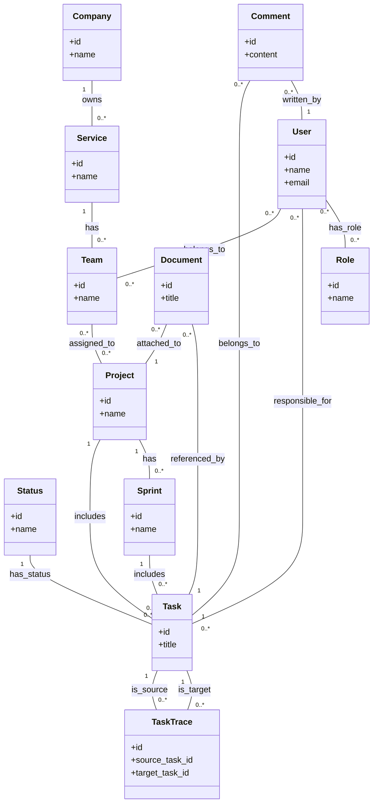

# クラス図

```mermaid
classDiagram
    class User {
        +id
        +name
        +email
    }

    class Team {
        +id
        +name
    }

    class Company {
        +id
        +name
    }

    class Service {
        +id
        +name
    }

    class Project {
        +id
        +name
    }

    class Task {
        +id
        +title
    }

    class Status {
        +id
        +name
    }

    class Document {
        +id
        +title
    }

    class Role {
        +id
        +name
    }

    class Comment {
        +id
        +content
    }

    class Sprint {
        +id
        +name
    }

    class TaskTrace {
        +id
        +source_task_id
        +target_task_id
    }

    %% Relationships
    User "0..*" -- "0..*" Team : belongs_to
    Company "1" -- "0..*" Service : owns
    Service "1" -- "0..*" Team : has
    Team "0..*" -- "0..*" Project : assigned_to
    User "0..*" -- "0..*" Task : responsible_for
    Project "1" -- "0..*" Task : includes
    Status "1" -- "0..*" Task : has_status
    Document "0..*" -- "1" Project : attached_to
    Document "0..*" -- "1" Task : referenced_by
    User "0..*" -- "0..*" Role : has_role
    Comment "0..*" -- "1" Task : belongs_to
    Comment "0..*" -- "1" User : written_by
    Sprint "1" -- "0..*" Task : includes
    Project "1" -- "0..*" Sprint : has
    Task "1" -- "0..*" TaskTrace : is_source
    Task "1" -- "0..*" TaskTrace : is_target
```