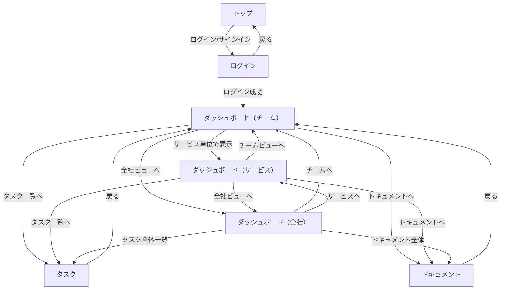

# 画面遷移図

1. トップ
2. ログイン
3. ダッシュボード（チーム）
4. タスク
5. ドキュメント
6. ダッシュボード（サービス）
7. ダッシュボード（全社）

```mermaid
flowchart TD
    トップ["トップ"]
    ログイン["ログイン"]
    ダッシュボード_チーム["ダッシュボード（チーム）"]
    ダッシュボード_サービス["ダッシュボード（サービス）"]
    ダッシュボード_全社["ダッシュボード（全社）"]
    タスク["タスク"]
    ドキュメント["ドキュメント"]

    トップ -->|ログイン/サインイン| ログイン
    ログイン -->|ログイン成功| ダッシュボード_チーム
    ログイン -->|戻る| トップ

    ダッシュボード_チーム -->|タスク一覧へ| タスク
    ダッシュボード_チーム -->|ドキュメントへ| ドキュメント
    ダッシュボード_チーム -->|サービス単位で表示| ダッシュボード_サービス
    ダッシュボード_チーム -->|全社ビューへ| ダッシュボード_全社

    ダッシュボード_サービス -->|タスク一覧へ| タスク
    ダッシュボード_サービス -->|ドキュメントへ| ドキュメント
    ダッシュボード_サービス -->|チームビューへ| ダッシュボード_チーム
    ダッシュボード_サービス -->|全社ビューへ| ダッシュボード_全社

    ダッシュボード_全社 -->|タスク全体一覧| タスク
    ダッシュボード_全社 -->|ドキュメント全体| ドキュメント
    ダッシュボード_全社 -->|チームへ| ダッシュボード_チーム
    ダッシュボード_全社 -->|サービスへ| ダッシュボード_サービス

    タスク -->|戻る| ダッシュボード_チーム
    ドキュメント -->|戻る| ダッシュボード_チーム
```