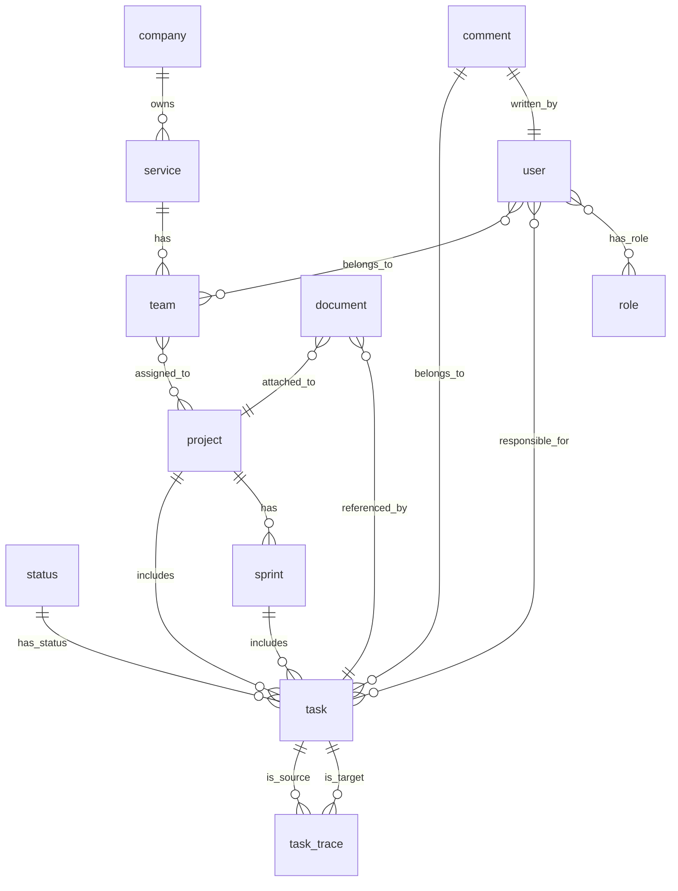

# テーブル設計

```mermaid
erDiagram
  user }o--o{ team : belongs_to
  company ||--o{ service : owns
  service ||--o{ team : has
  team }o--o{ project : assigned_to
  user }o--o{ task : responsible_for
  project ||--o{ task : includes
  status ||--o{ task : has_status
  document }o--|| project : attached_to
  document }o--|| task : referenced_by
  user }o--o{ role : has_role

  comment ||--o{ task : belongs_to
  comment ||--|| user : written_by

  sprint ||--o{ task : includes
  project ||--o{ sprint : has

  task ||--o{ task_trace : is_source
  task ||--o{ task_trace : is_target
```